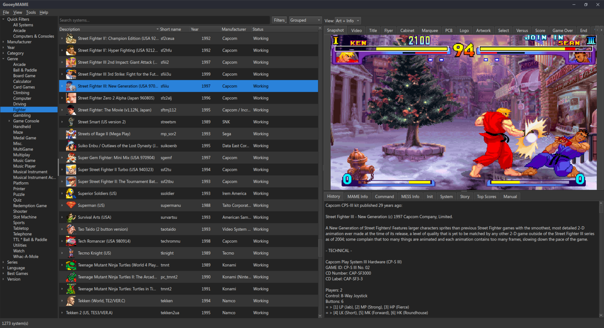
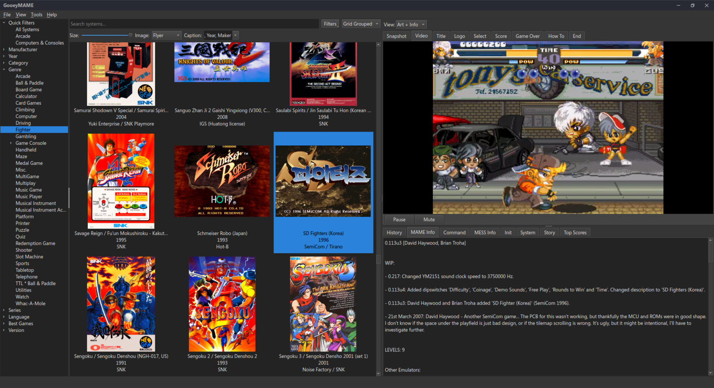
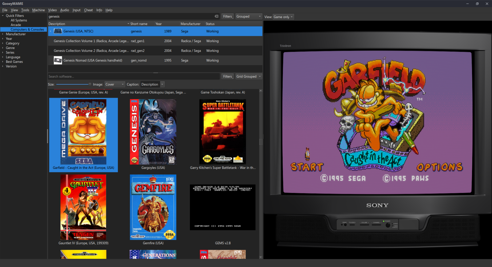
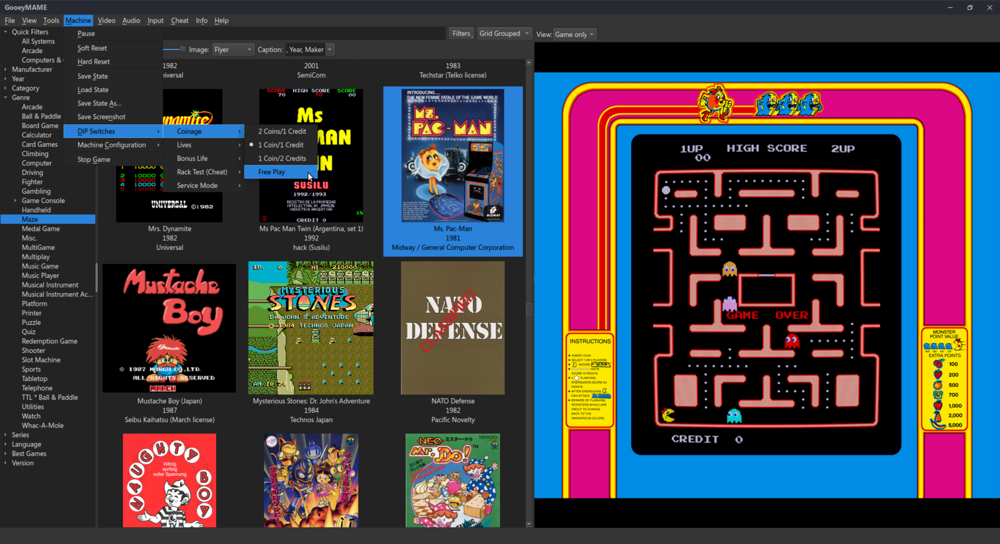
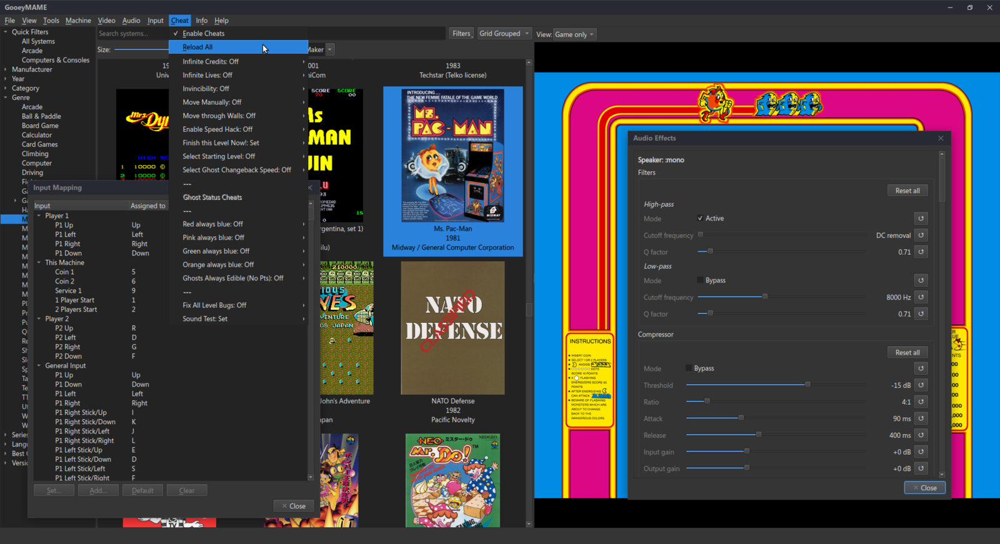

<div align="center">


# GooeyMAME

**A modern, cross-platform Qt front-end built _into_ MAME.**

Browse thousands of arcade machines, consoles and computers, dig through artwork and history,
audit your ROMs, and play — all in one native window, with the game embedded right inside it.

<em>GooeyMAME = MAME + a “gooey” (GUI). One executable, no launcher gymnastics.</em>

</div>

---

GooeyMAME is a fork of [MAME](https://www.mamedev.org/) that adds a first-class graphical
front-end as a native OSD (`OSD=qtui`). It's a clean-room Qt UI compiled directly into the
emulator — so metadata, ROM auditing, and gameplay all come from the live MAME core with no
subprocess round-trips or IPC. Games render **inside** the browser via a Qt-native OpenGL/BGFX
backend, with a full in-game menu bar driving the running machine.

Based on **MAME 0.288**. Runs on **Linux** and **Windows** (macOS planned).

## Screenshots

#### Browse with live artwork, video and info
Every system alongside its snapshot/video/flyer/marquee art and a stack of info tabs
(history, MAME info, command list, top scores, PDF manual, and more).



#### Grid view — covers, flyers, snapshots
A DuckStation-style tile grid for both machines and software lists, with a size slider,
selectable art source, and configurable caption. Video previews play in place.



#### Software lists for consoles & computers
Pick a system (e.g. Sega Genesis), browse its software list with box/cart art, and see it
running with bezel artwork — all from the same window.



#### Play embedded, with a full in-game menu bar
The game runs inside the window. A NEWUI-style menu bar operates the live machine —
DIP switches, machine configuration, save states, media, rotate, throttle, and more.



#### Cheats, input remapping and audio effects — live
Toggle cheats, remap every control, and dial in per-speaker EQ / filters / compressor
while the game is running.



## Features

### Browsing & organising
- **Full machine list** straight from the MAME driver database — Description, Short name, Year,
  Manufacturer and ROM Status columns, all sortable.
- **Three view modes** per list: **List** (flat table), **Grouped** (clone-family tree), and
  **Grid** (art tiles with a size slider, selectable image source and caption).
- **Rich filter tree** — Arcade vs. Computers & Consoles, Manufacturer, Year, Category, Genre,
  Series, Language, Best Games, Version. Collapsible, sectioned, and hides empty categories.
- **Status filters** (Working / Available) as modifiers on the current list, with a per-pane
  search box.
- **Clone families, regions & versions** — group clones under a representative, prefer a region,
  and hide bootlegs / hacks / prototypes; pick a family's default version from a right-click menu.
- **Mechanical** and **Screenless** system-type filters.
- **Software lists** (consoles/computers) get their own list/grouped/grid views, search,
  filtering and availability.

### Artwork & information
- **Art tabs**: Snapshot, Video (gameplay + advert, with pause/mute), Title, Flyer, Cabinet,
  Marquee, PCB, Logo, Artwork, Select, Versus, Score, Game Over — plus Box / Cart / 3D for software.
- **Info tabs**: History, MAME Info, Command, MESS Info, Init, System, Story, Top Scores, and a
  built-in **PDF manual viewer**.
- **Configurable art fallback** (software → host machine → clone parent), a **secondary media
  source**, per-art-type scaling, list row icons, and automatic hiding of empty tabs.

### ROM management
- **Availability auditing** for machines and software — cached, persisted, bulk-refreshable, and
  auto-invalidated when your ROM/hash paths change.
- **Options editor** that reads and writes `mame.ini`, a **per-machine Properties** dialog that
  writes `<system>.ini` overrides, and front-end folder configuration.

### Play — Qt-native, embedded
- **Qt-native OSD**: MAME renders into a `QWindow` via **OpenGL or BGFX** (no SDL video), taking
  keyboard, mouse, lightgun and text input from Qt. Play embedded **in a pane**, in a **separate
  window**, or launch straight into a game with `--gooey <system>`.
- **BGFX shader chains** (CRT effects, etc.) with a runtime backend selector.
- **Full in-game menu bar** operating the live machine:
  - **Machine** — pause, soft/hard reset, save / load / save-as state, screenshot, BIOS selection,
    slot devices, media mount/unmount, tape / network / barcode, DIP switches, machine config, stop.
  - **Video** — sharp/smooth pixels, render view, artwork & bezel visibility, rotate, aspect &
    scaling, zoom-to-screen, fullscreen, brightness/contrast/gamma, throttle, frameskip, FPS, speed.
  - **Audio** — master and per-channel volume.
  - **Input** — emulated vs. natural keyboard, paste, crosshair options, and a live **input
    remapping editor**.
  - **Info** — system information, warnings, bookkeeping, and history.
  - **Cheat** — global enable, reload, and per-cheat toggles.
- **Audio effects editor** (per-speaker EQ / filters / compressor) and a **plugin options** menu.
- **Gamepad support** — winhybrid / XInput / DirectInput on Windows, SDL game-controller on Linux,
  with a runtime provider selector and sensible default mappings.

### Appearance & quality-of-life
- **View → Style** (any installed Qt widget style) and **View → Color Scheme** (System / Light /
  Dark, auto-pairing with Fusion where the platform style ignores palettes).
- **Collapsible panes** and full **GUI-state persistence** — window geometry, splitters, column
  widths, view modes, filters, search text and selection all restore on next launch.
- **No-Nag** — independently skip the system-information, warning, and loading screens.
- **Application icon** on every platform.

## Building

GooeyMAME builds like MAME, selecting the Qt OSD with `OSD=qtui`.

### Prerequisites

- A C++17 toolchain and Python 3 (same as upstream MAME).
- **Qt 6** (base + widgets; optionally Qt Multimedia + FFmpeg for video previews, and Qt PDF for
  the manual viewer), discoverable via `qmake6`.
- **Linux**: OpenGL, X11/XInput, fontconfig, and SDL2 (used only for the game-controller module).

### Linux

```sh
make OSD=qtui SUBTARGET=mame -j"$(nproc)"
./mame            # no arguments → launches the GUI
```

The Qt Multimedia and Qt PDF features are auto-detected; pass `NO_QTPDF=1` to skip the manual
viewer if Qt PDF isn't installed.

### Windows

Built with MSYS2 (UCRT64) and the `mingw-w64-ucrt-x86_64-qt6-*` packages:

```sh
REGENIE=1 make OSD=qtui SUBTARGET=mame -j16
```

The Windows build is fully SDL-free (native XInput / DirectInput gamepads). For a redistributable
build, deploy the Qt runtime next to `mame.exe` (see `windeployqt6` plus the FFmpeg codec DLLs).

### Desktop integration (Linux)

`scripts/resources/unix/` contains a `.desktop` entry and an installer:

```sh
scripts/resources/unix/install-desktop.sh /path/to/mame
```

## Relationship to MAME

GooeyMAME is a downstream fork of MAME. The front-end lives entirely under `src/osd/qtui/` (plus a
handful of additive OSD modules) and is **clean-room Qt** — it shares no code with any other MAME
front-end. Everything else is stock MAME 0.288.

- Upstream project: <https://www.mamedev.org/>
- The original MAME README is preserved at [`docs/README.mame.md`](docs/README.mame.md).

> **Origin.** GooeyMAME was originally inspired by a wish for a cross-platform equivalent of
> MAMEUI (the Windows-only MAME front-end). It is, however, **unrelated to MAMEUI and shares no
> code unique to that project** — the entire front-end was written from scratch in Qt against the
> official MAME core.

Please **do not** report GooeyMAME issues to the MAME team — they are not responsible for this fork.

## License

Same as MAME: predominantly **BSD-3-Clause**, with some components under other free-software
licenses. See [`docs/legal/`](docs/legal) / [`COPYING`](COPYING) and the per-file license headers.
MAME® is a trademark of the MAME development team; GooeyMAME is an independent fork and is not
endorsed by or affiliated with the MAME project.

## Credits

Built on the work of the **MAME development team** and its thousands of contributors. The Qt
front-end and Qt-native OSD are GooeyMAME additions.
